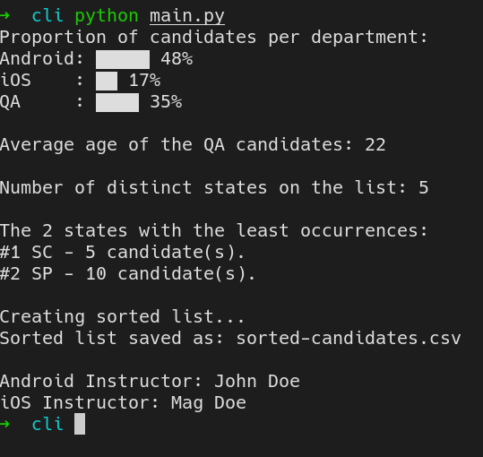

### CSV Challenge
This is a simple challenge made for begginer programers that consist on small operations around a csv file. The file called [candidates.csv](candidates.csv) have some simple information about people who
are candidates of a job selection, like: **name**, **department**, **age**, **state**.

### Requirements
Your program will need to fulfill some requirements:
1. Show the percentage of candidates from **Android**, **iOS** and **QA**.
2. Show the average age of **QA** candidates.
3. Show the distinct number os states inside the file.
4. Show the state name and the amount of candidates of the two least recurring states.
5. Order the `candidates.csv` file by the names alphabetical order and save as **sorted-candidates.csv**.

#### Occult People
There are 2 special people meant to be discovered by you, you'll need to follow some hints to find an **iOS instructor** and an **Android instructor**.

- The **iOS** instructor is more than 20 years old.
- The **Android** instructor is younger than the **iOS** one.
- The **iOS** instructor age is a prime number.
- The first name of the **Android** instructor has 3 vowels.
- The last letter of the **Android** instructor's first name is `o`.
- The first letter of the **iOS** instructor's last name is `V`
- Both instructor's age is an odd number.
- Both instructor's were born in the same decade.
- Both instructor's have less than 31 years.
- The **department** assigned to both instructor's inside the file is not what they'll be instructing.
- Both instructors are from `SC`.

### Programming Languages
You can pick what suits you better and clone the repository.

### Program Visual
Unless you want to create a platform specific visual representation of the challenge (like web, or mobile) you can use a simple terminal output to print the requirements:

### Don't forget
Review and make your code as clean as possible, try to make it performatic and test it.

### Special Thanks
Special thanks for the [original challenge](https://github.com/premiersoft/AppAcademyChallenge) that made my way into programming.
